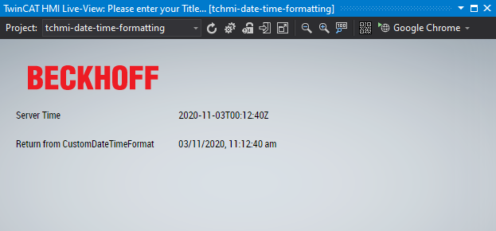

# Simple example of formatting the date / time from the server

## Disclaimer
This is a personal guide not a peer reviewed journal or a sponsored publication. We make
no representations as to accuracy, completeness, correctness, suitability, or validity of any
information and will not be liable for any errors, omissions, or delays in this information or any
losses injuries, or damages arising from its display or use. All information is provided on an as
is basis. It is the reader’s responsibility to verify their own facts.

The views and opinions expressed in this guide are those of the authors and do not
necessarily reflect the official policy or position of any other agency, organization, employer or
company. Assumptions made in the analysis are not reflective of the position of any entity
other than the author(s) and, since we are critically thinking human beings, these views are
always subject to change, revision, and rethinking at any time. Please do not hold us to them
in perpetuity.

## Overview 
This is a simple example to show how to use a custom function to format the date and time received from the server variable.  



In order to see the server symbols you must enable advanced view in TcHmi Configuration, which can be done by clicking the three dots on the top bar.

### Intl.DateTimeFormat
This code uses the Intl.DateTimeFormat found here...

https://developer.mozilla.org/en-US/docs/Web/JavaScript/Reference/Global_Objects/Intl/DateTimeFormat

### Javascript
```
function CustomDateTimeFormat(DateTimeString) {

                // example of a substitute date time format when TcHmi.Localization.formatDate(date) is not possible.

                var date = new Date(DateTimeString);

                var options = {
                    year: 'numeric', month: 'numeric', day: 'numeric',
                    hour: 'numeric', minute: 'numeric', second: 'numeric',
                    hour12: true,
                };

                return (new Intl.DateTimeFormat('en-GB', options).format(date));

            }
```

## Install 
Not required.  Simply open the project.

## TwinCAT
This project uses TcXaeShell 3.1.4024.10 and TwinCAT Hmi 1.12.742.5

## Getting started
This is not a guide for TcXaeShell, please visit http://beckhoff.com/ for further guides
* Open the included TwinCAT project and activate on your local machine
* Open Desktop.view in live view

